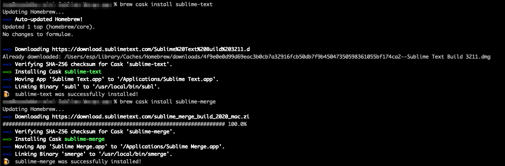
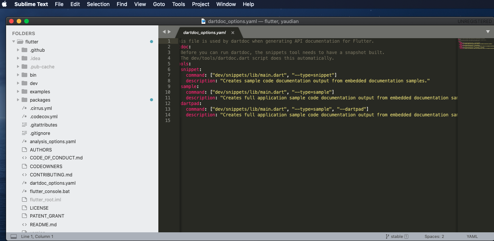
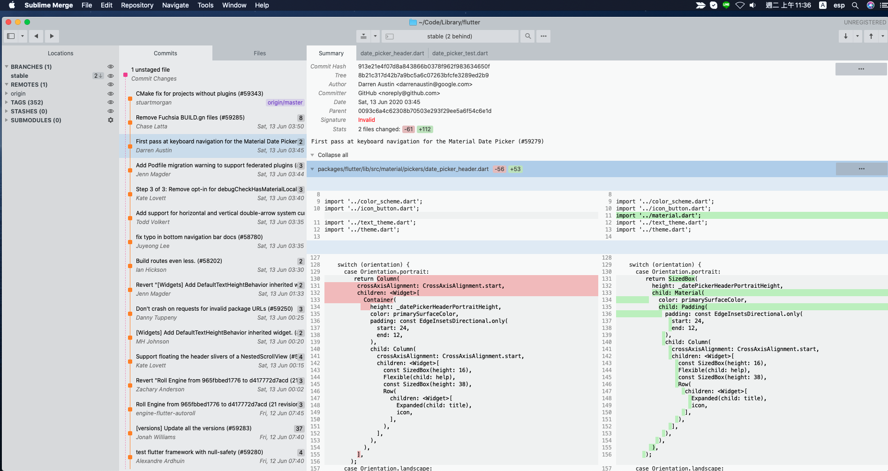

# Sublime

* sublime-text : 文字編輯器

* sublime-merge : git client gui

* 安裝方式 for mac
  * 官網下載安裝，可能是 xxx.dmg (安裝包) 或是 zip 解壓縮拖曳到 application
  * 也可以使用 Homebrew 安裝 (需使用 brew cask 命令)

  ``` shell
  brew cask install sublime-text

  brew cask install sublime-merge
  ```

* 使用 Homebrew 安裝
  

* Sublime Text 範本
  

* Sublime Merge 範本
  

* 參考網站
  * [Sublime Text - A sophisticated text editor for code, markup and prose](https://www.sublimetext.com/)
  * [Sublime Merge - Git Client, done Sublime](https://www.sublimemerge.com/)
