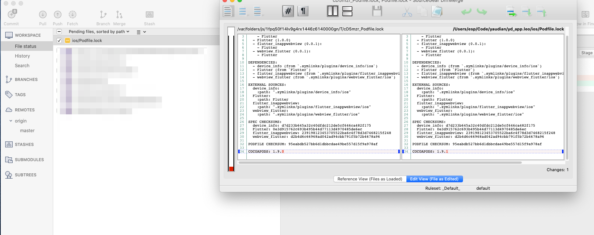

# diffmerge for Sourcetree

## 前言

`Sourcetree` 的預設差異比對為 mac 內建差異比對軟體 `FileMerge`

但 `FileMerge` 在比對檔案時，常常會 crash，尤其在專案檔之類的大檔案

於此找尋另一套解決方案，此階段找到的是 `DiffMerge`，在此情境下，介紹如何安裝及 `Sourcetree` 啟動 `DiffMerge`。

---

## 安裝 DiffMerge

* 有兩種方式
  * 官網下載套件安裝：
    安裝完需做後續處理，手動copy 檔案到對應目錄(/usr/local/bin)，此做法有點麻煩。
  * HomeBrew 工具安裝:
    會自動做 link 到 /usr/local/bin，此做法較為簡潔，本文介紹此作法

* HomeBrew 指令

  ``` shell
  brew cask install diffmerge
  ```

* 範例
  

---

## Sourcetree 差異比對軟體改成 DiffMerge

* 點選上方功能列的 [Sourcetree][Preferences]
  

* 修改 Diff 相關設定
  

* 注意: 不可單純選擇 DiffMerge
  > 會啟動失敗，需客製化啟動方式
  

* 修正為 Custom
  * Diff

  ``` txt
  Command: /usr/local/bin/diffmerge
  Arguments --nosplash "$LOCAL" "$REMOTE"
  ```

  * Merge

  ```txt
  Command: /usr/local/bin/diffmerge
  Arguments --nosplash --merge --result="$MERGED" "$LOCAL" "$BASE" "$REMOTE"
  ```

  

* 測試
  * choose diff file
  

  * result
  

---

## 參考

* [Sourcetree fails to open Diffmerge for merge conflicts - Stack Overflow](https://stackoverflow.com/questions/53249870/sourcetree-fails-to-open-diffmerge-for-merge-conflicts)
